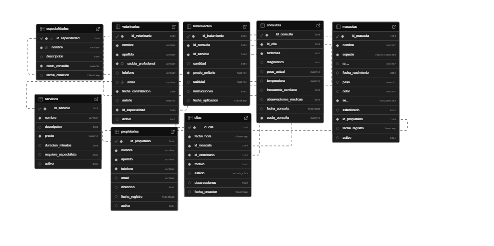

# 🐈‍⬛ Sistema de Base de Datos para Clínica Veterinaria  

## Descripción del Proyecto  
Este proyecto consiste en el diseño e implementación de una base de datos completa para la gestión integral de una clínica veterinaria. El sistema permite administrar de manera eficiente la información de pacientes (mascotas), propietarios, citas médicas, tratamientos, historial clínico y facturación.  

## Objetivos 🐶  
1. Gestión Integral de Pacientes: Crear un sistema robusto para el registro y seguimiento de mascotas, incluyendo información médica completa, historial de tratamientos y datos del propietario.  

2. Optimización de Procesos Administrativos: Automatizar y simplificar los procesos de agendamiento de citas, facturación y gestión de inventario médico para mejorar la eficiencia operativa de la clínica.  

3. Análisis de Datos Clínicos: Facilitar la generación de reportes estadísticos sobre tratamientos, especies atendidas, ingresos y tendencias de salud animal para apoyar la toma de decisiones estratégicas.  

## Tecnologías Utilizadas 🧑‍💻  
- Editor de Código: Visual Studio Code 
- Control de Versiones: Git 
- Repositorio Remoto: GitHub 
- Lenguaje de Consultas: SQL 
- Documentación: Markdown    

### Integrantes 👨‍👩‍👧‍👦 
1. Danna Suazo 
2. Danna Perdomo 
3. Lizania Rodríguez
 4. Carlos Castañeda 
 5. Isaac Mejía   
 
 ### Enlace 
 [SupaBase](https://supabase.com/dashboard/project/ljghhmbabknwjsywyepe/database/schemas)   ### Esquema de BD   
 
 ## Diagrama ED [dbdiagram](https://dbdiagram.io/d/Diagrama-ER-Red-social-6850de543cc77757c821e08a)   
 
  >[NOTE] >Este proyecto es totalmente ficticio.

